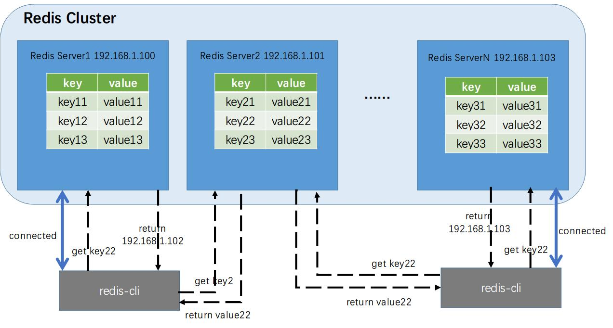
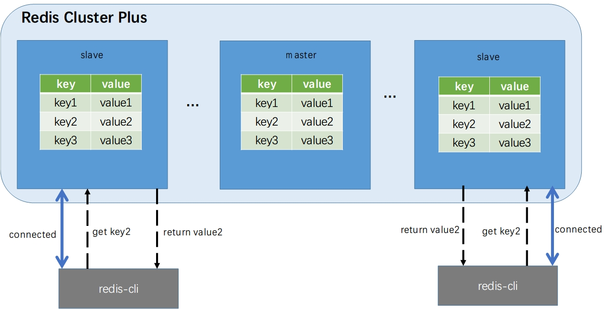

# Rdma Accelerating Redis

## 1 Introduction

In scenes where images are frequently accessed, such as accessing online galleries on social software. The images are stored on the disks of the servers. When clients want to access the image, the server needs read it to the memory and sent it to the client. Putting the images into NoSQL in main memory is a emerging scheme used to accelerate the access. Based on this background, the strategy of Redis as the image buffer is to convert the image into base64 code and store it in the Redis cluster.

Redis itself comes with a official solution of providing cluster. By modifying the configuration text files in Redis and executing scripts, several independent Redis servers can be combined into one cluster to provide external services. By the way, traditional implement of redis cluster requires two TCP connections open. We can run `src/redis-cli`in cluster mode, or use other user-friendly client such as Jedis. When we execute `set` command to add a pair of key values to the cluster, redis will store the key-value into one server of the cluster. In other words, only one server have the value. Redis cluster does not use consistent hashing, but a different form of sharding where every key is conceptually part of what we call an hash slot. So Even if the cluster is configured to enable replication, then a pair of key-value is only stored in the Master node and Slave node. When we execute `get` command, redis will automatically return the value from the node it stored in fact as showed in the figure below.



However, Redis cluster also pose unique challenges such as performance and overload:

1. Regardless of the number of machines in the cluster, just one pair of key-value exists in the cluster system. In some application scenarios, a small set of data is frequently accessed by a large number of clients and this will overload the server. The traditional solution only increases the capacity of cluster but reduces performance when overload access to hotpot dataset happened.
2. The Redis service is single-thread modal, which means that the Redis server can only serve the requests in a sequence order. The Redis client connects to only one Redis server in the cluster. If the key of the request is not found in the peer Redis server, the Redis server is responsible for searching the destination server and return the ip address and port to the client. Then the client can get data from the correct server node. In some application scenarios, some clients may initiate a `get` request for one or several keys at the same time. All requests end up waiting for the same server to return results, increasing the delay and then overwhelmed the single server.



In order to solve the above problems, we propose a hot backup scheme for cluster called RCP (Redis Cluster Plus). In RCP, the data stored on each Redis server is same so that client can get the value fast without redirection. Each Redis server in the entire cluster can provide service independently. When a large number of clients access the RCP cluster, the requests are distributed among all the clusters. 

## 2 Redis Cluster Plus

As mentioned above, we designed a new Redis server cluster called RCP. When the RCP cluster is initialized, all the data stored on the master is synchronized to all the slave machines in the cluster. Suppose now that there is a Redis server that stores more than 10,000 images encoded by base64. These 10,000 images are offline. Now we want to build the RCP with 10 machines getting better performance by more available servers. How to synchronize the data from the master node to another 9 slave nodes is a challenge problem.

Suppose we use the traditional TCP/IP communication, the synchronization step is as follows:

1. 9 slaves establish a TCP connection with the master respectively;
2. The master node reads a key-value pair from the local, and sends it to 9 slaves in sequence through the socket;
3. After receiving the key-value, the slave saves it to the local Redis database.
4. If the master has not been traversed, continue with step 2; otherwise stop.

The way TCP/IP looks simple, but in practice the performance is very low, we found that this synchronization method takes a long time to test. First, the TCP/IP network itself has data transmission and protocol stack overhead; Second, multi-client communicates at the same time, the master node network is highly competitive; Third, the synchronous operation cannot be completely asynchronous. In addition to the time overhead, during synchronization, the CPU load on the master machine is very high, affecting other loads running on the master itself.

We used RDMA to design a cluster synchronization scheme. Experiments show that our synchronization scheme can improve performance by 4 times compared with TCP/IP synchronization. The more slaves a cluster needs to synchronize, the more obvious the advantage of our synchronization scheme is because We use RDMA unilateral operation, and all slaves read data from the master in parallel. The process of synchronizing using RDMA is as follows:

1. The master creates a mapping table whose structure is shown in Figure 1-3. The mapping table is divided into two parts. The front part is an 8-byte address area, each area is used to record the address; the latter part is a 4 MB data area for storing data in the Redis server. The address area corresponds to the data area, and the address of the first data area is stored in the first address area;
2. 9 slaves establish an RDMA connection with the master respectively. During the process of establishing the connection, the master sends the starting address of the mapping table to each slave;
3. The slave calculates the address of the data according to the starting address of the mapping table and the offset of the data. The slave uses the calculated address to initiate an RDMA read request, reads a data area data from the master, and stores the data locally. ;
4. If the calculated address does not cross the boundary, continue with step 3; otherwise, end the process.


## 3 Building Environment

All the testing work in this article was done under Ubuntu 16.04. The process of manually setting up three Master nodes using the Redis Cluster solution is as follows:

In order to create a cluster, we first need to configure the Redis server to run in cluster mode. So you can use the following configuration script file:

```shell
bind 192.168.1.100
port 7000
cluster-enabled yes
cluster-config-file nodes.conf
cluster-node-timeout 5000
appendonly yes
```

Then create 3 copies of the compiled Redis instance to 3 folders, and start the server according to the above configuration file:

```shell
mkdir cluster-test
cd cluster-test
./src/redis-server ./cluster.conf
```

The cluster can be easily manipulated through a basic program `redis-trib` provided by Redis. This program is written in Ruby and placed in `src/`. Therefore, you need to install the ruby development environment and the corresponding redis interface. After the pre-preparation is completed, you can use the following command to establish a cluster.

```shell
./redis-trib.rb create {ip-1}:7000 {ip-2}:7000 {ip-3}:7000
```

Such a simple command only creates a cluster of three Master Nodes, without any Slave Node for backup.